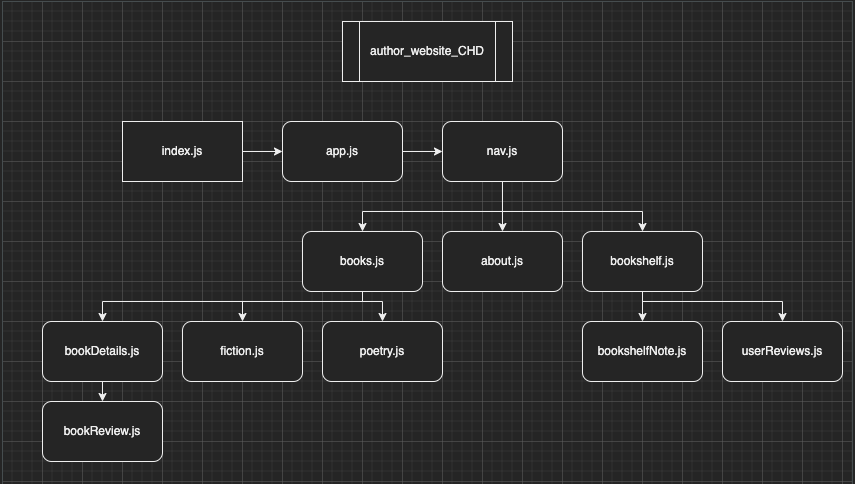
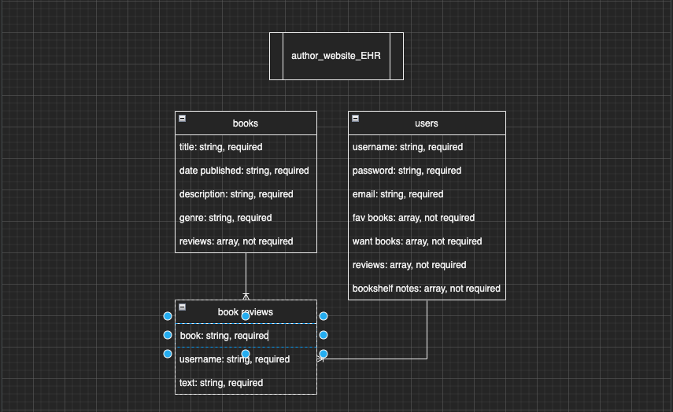

# **Project Two: 'author website'**
## Date: 7/25/2022
### By: Kristina DeSilva

#### [Github](https://github.com/kavdesilva)

***

### *Description*
#### A website featuring an author's published works, both poetry and fiction. Website will have a 'bookshelf' in which users can add a book to their list of favorites or a 'want-to-read' list.

***

### [link]

***

### *Languages*
* Mongoose
* Express
* React
* Node.js

***

### *Trello Board*
#### [project one - 'author website'](https://trello.com/b/MNbylibH/author-website)

***

### *CHR/ERD*

### Component Heirarchy Diagram (CHD)

### Entity Relationship Diagram (ERD)

***

### *Future Updates*
- [x] README.md
- [x] Trello Board
- [ ] Wireframes
- [x] ERD
- [x] CHD
- [x] Books Database
- [ ] Pages (built w/ React)

### *Post-MVP*
- [x] TBD

***

### *Credits*
#### Inspo: [22 Children's Author & Illustrator Websites That Delight](https://rocketexpansion.com/childrens-author-websites/)
#### More Inspo: [Shel Silverstein Official Website](https://shelsilverstien.com/)
#### [Register and Login System in MERN Stack](https://dev.to/crackingdemon/register-and-login-system-in-mern-stack-1n98)
